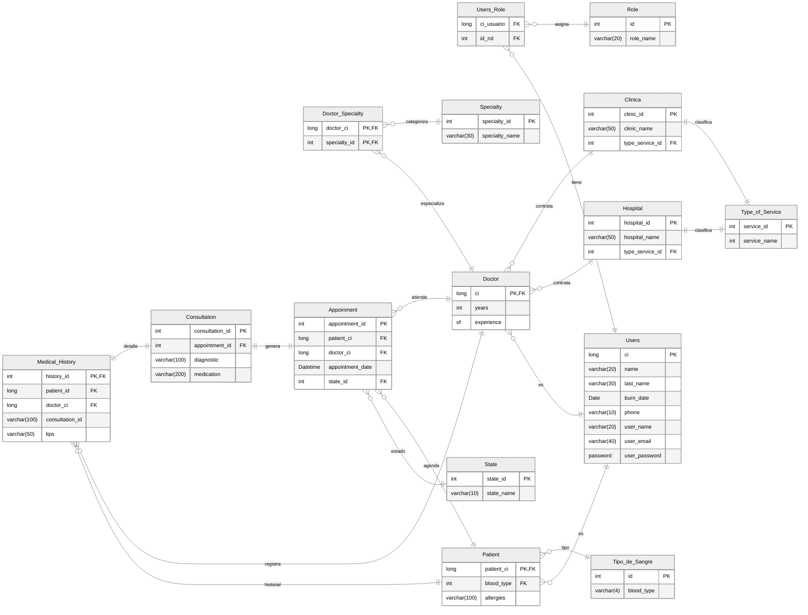

# Salud Total

### Objetivos
- facilitar la reserca de cupos 
- reducir el ausentismo
- optimizar la asignacion de medicos y horarios
- centralizar informacion medica basica 
- generar reporte de citas, cancelaciones y asistencias medicas 

### Objetivos secundarios 
- Gestion del historial medico del paciente, centralizar estos datos, cuando el paciente se vaya a otro centro medico tenga el historial en la aplicacion, para evitar 
- la monopolizacion del historial. 
- Poder marcar la consulta, ver todo el historial y vaya a saber que pedo mas 

### Objetivos Centralizados
- Reserva centralizada
- Historial medico universal 
- seguridad y privacidad (accesso solo para medicos y pacientes autorizados)
- Reduccion de perdida de informacion 
- Automatizacion de reportes y diagnosticos

#### SALUD TOTAL 
> Es una plataforma medica universal del gobierno 

### Funcionalidades
- Modulo de pacientes
    - Registro unico con CI 
    - Accesso a su historial medico personal
    - Agendar cita medica en hospitales o clinicas 
    - Reservacion de citas y recordatorio via email
- Modulo Doctor
    - Accesso al historial de los pacientes (hasta finalizar la consulta o cita)
    - Registro de consultas, diagnosticos, recetas y tratamientos
    - Agendar turnos de trabajo
    - Generacion de reportes medicos

- Modulo de clinicas y hospitales
    - Gestion de especialidades y medicos  
    - Administracion de horarios 
    - Reportes de asistencia y flujo de pacientes

---
## Dominio
- Contexto.-
  - Gestión de servicios médicos(Citas), manejo de recursos médicos(Historial Médico, turnos, horarios,medicamentos,etc), generación de reportes,gestión de hospitales,clínicas y gestión de la información del personal involucrado(Pacientes, Doctores)
- Entidades Principales
    - Paciente
    - Doctor
    - Tipo de sangre
    - Hospitales
    - Clínicas
    - Citas
    - Consulta
    - Usuarios
    - Rol
    - Historial Médico
    - Turnos
    - Tipo de Servicio
    - Horarios
    - Especialidad
    - Tratamiento 
    - Receta(opcional)
- Relaciones.-
    - Los Pacientes y los Doctores son Usuarios.
    - Los Usuarios tienen uno o más roles.
    - Los Doctores tienen una o más especialidades.
    - Los Pacientes tienen un historial médico.
    - Los Doctores también son pacientes.
    - Los Doctores trabajan en uno(a) o más hospital(es) o clínicas
    - Un Doctor tiene un turno asignado por hospital o  clínica
    - Un Doctor registra sus horarios disponibles
    - Un Doctor atiende una cita con un Paciente
    - Los Pacientes pertenecen a uno o
    - Un Hopital o Clinica tiene un tipo de servicio (estatal o privado)

### Entidades 
- Usuario
    - ```mermaid
        erDiagram
        %%{init: {'theme':'dark'}}%%
            usrs[Users]{
                long ci PK
                varchar(20) name
                varchar(30) last_name
                Date burn_date
                varchar(10) phone
                varchar(20) user_name
                varchar(40) user_email
                password user_password
            }
        ```
- Rol
  - ```mermaid
        erDiagram
        %%{init: {'theme':'dark'}}%%
            rl[Role]{
                int id PK
                varchar(20) role_name
            }
    ```
- Tipo de Sangre
  - ```mermaid
        erDiagram
        %%{init: {'theme':'dark'}}%%
            blTy[Tipo_de_Sangre]{
                int id PK
                varchar(4) blood_type
            }
    ```
- Paciente
  - ```mermaid
        erDiagram
        %%{init: {'theme':'dark'}}%%
            pt[Patient]{
                long patient_ci PK,FK
                int blood_type FK
                varchar(100) allergies
            }
    ```
- Doctor
  - ```mermaid
        erDiagram
        %%{init: {'theme':'dark'}}%%
            dctr[Doctor]{
                long ci PK,FK
                int years of experience
            }
    ```
- Tipo de Servicio
  - ```mermaid
        erDiagram
        %%{init: {'theme':'dark'}}%%
            tp[Type_of_Service]{
                int service_id PK
                varchar(20) service_name
            }
    ```
- Hospital
  - ```mermaid
        erDiagram
        %%{init: {'theme':'dark'}}%%
            hs[Hospital]{
                int hospital_id PK
                varchar(50) hospital_name
                int type_service_id FK
            }
    ```
- Clinica
  - ```mermaid
        erDiagram
        %%{init: {'theme':'dark'}}%%
            cl[Clinica]{
                int clinic_id PK
                varchar(50) clinic_name
                int type_service_id FK
            }
    ```
- Especialidad
  - ```mermaid
        erDiagram
        %%{init: {'theme':'dark'}}%%
            spc[Specialty]{
                int specialty_id PK
                varchar(30) specialty_name
            }
    ```
- Doctor-Especialidad
  - ```mermaid
        erDiagram
        %%{init: {'theme':'dark'}}%%
            de[Doctor_Specialty]{
                long doctor_ci PK,FK
                int specialty_id PK,FK
            }
    ```
- Estado
  - ```mermaid
        erDiagram
        %%{init: {'theme':'dark'}}%%
            st[State]{
                int state_id PK
                varchar(10) state_name
            }
    ```
- Cita
  - ```mermaid
        erDiagram
        %%{init: {'theme':'dark'}}%%
            dt[Appoinment]{
                int appointment_id PK
                long patient_ci FK
                long doctor_ci FK
                Datetime appointment_date
                int state_id FK
            }
    ```
- Consulta
  - ```mermaid
        erDiagram
        %%{init: {'theme':'dark'}}%%
            cn[Consultation]{
                int consultation_id PK
                int appointment_id FK
                varchar(100) diagnostic
                varchar(200) medication
            }
    ```
- Historial Medico
  - ```mermaid
        erDiagram
        %%{init: {'theme':'dark'}}%%
            mh[Medical_History]{
                int history_id PK,FK
                long patient_id FK
                long doctor_ci FK
                int consultation_id
                varchar(50) tips
            }
    ```
### Relaciones

### Procesos clave.-

- Registro de un usuario único por Ci.
- Verificar la existencia del Usuario, caso contrario crear el usuario.
- Reserva de Cita en Hospitales o Clínicas.
- Acceso del Usuario  a su registro médico. 
- Acceso del Médico al registro del Paciente durante la Consulta 
- Registro  de Consultas, Diagnósticos, Recetas y Tratamientos en el registro del Paciente. 
- Registro de Horarios disponibles del Médico   
- Registro y Gestión de Especialidades y Médicos
- Asignación de turnos de trabajo para consultas médicas.
- Notificación de recordatorio de consulta vía email.
- Generación de reportes médicos de un doctor en el Hospital o - Clínica. 


### Modelado del Dominio.-

#### Diagramas de Procesos


#### Traducción del Dominio a Requisitos.-

##### Requisitos Funcionales

- El Sistema debe  Crear un Usuario único mediante el Ci. 
- El Sistema debe  Agendar Citas médicas en Hospitales o Clínicas. 
- El Sistema debe  Acceder al registro médico de un Paciente
- El Sistema debe  Generar reportes médicos para el Usuario.
- El Sistema debe  Agendar turnos de Trabajo
- El Sistema debe  Gestionar a los Médicos y Especialidades   
- El Sistema debe  Generar reportes de asistencia y flujo de pacientes. 

##### Requisitos No Funcionales

- El Sistema debe proteger la confidencialidad de los registros del paciente con respecto al Hospital ó Clínica una vez la consulta finalice.
- El sistema debe centralizar la información de los registros médicos de todos los pacientes.
- El sistema debe notificar al paciente con un recordatorio sobre su consulta vía email.
- El sistema debe permitir al Paciente o Doctor cancelar o reagendar una cita.
- El sistema debe permitir la visualización del registro universal médico del paciente.
